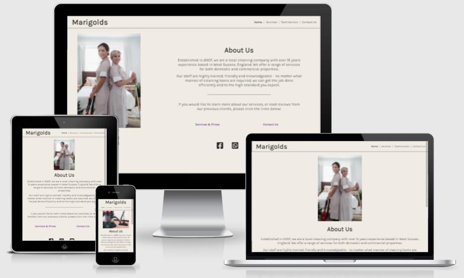
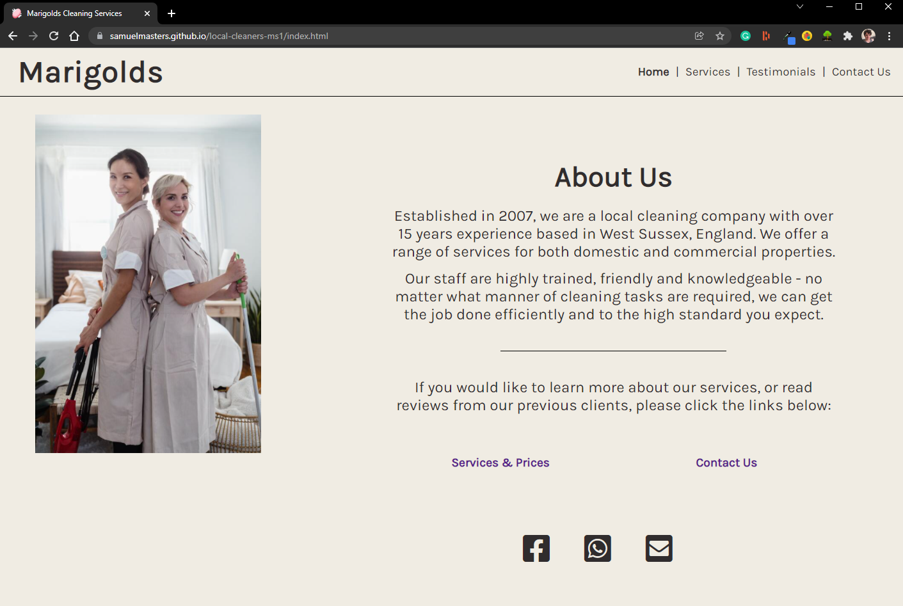
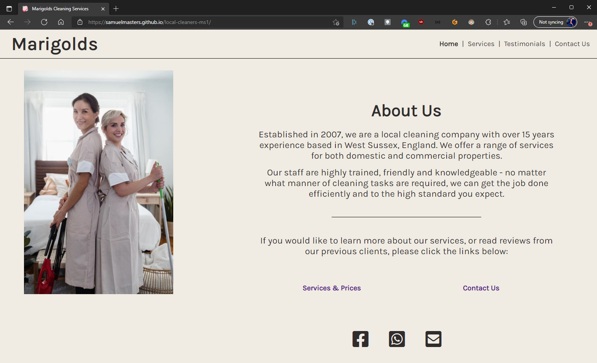
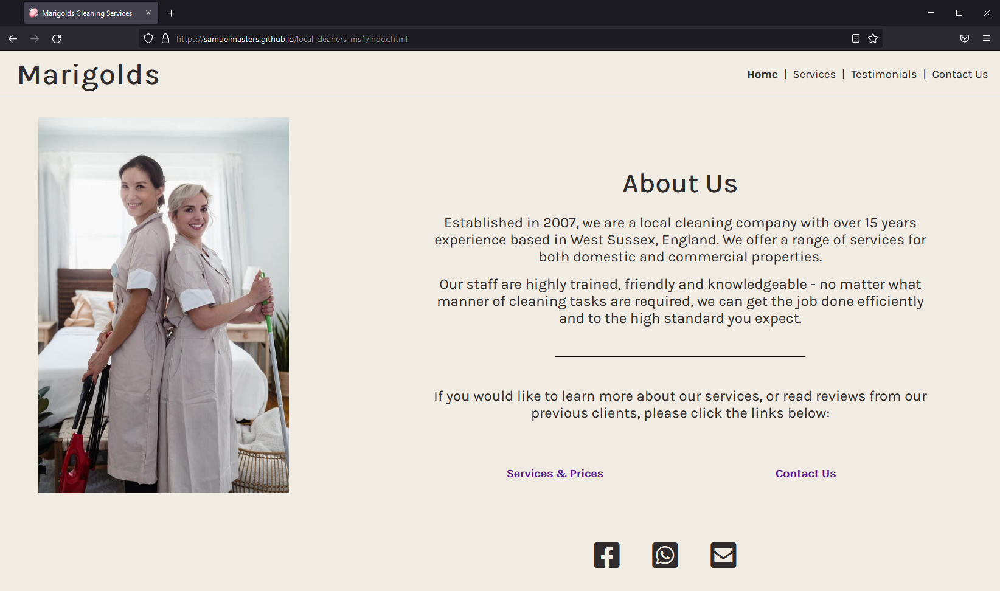

# Marigolds Cleaning Services

## By Samuel Masters

#### This project was developed to act as my first portfolio project, based on HTML/CSS Essentials, as part of my Diploma in Software Development with Code Institute.

### [Click here to view the website.](https://samuelmasters.github.io/local-cleaners-ms1/)

### [Click here to view the public repository.](https://github.com/SamuelMasters/local-cleaners-ms1)

# Table of Contents:

1. [The Why](#the-why)
2. [User Experience(UX)](#user-experience-UX)
   1. [Target Audience](#target-audience)
   2. [Strategy](#strategy)
   3. [Scope](#scope)
   4. [Structure](#structure)
   5. [Skeleton](#skeleton)
      1. [Wireframes](#wireframes)
   6. [Surface](#surface)
      1. [Colours](#colours)
      2. [Typography](#typography)
      3. [Images & Icons](#images-&-icons)
3. [Features](#features)
   1. [Current Features](#current-features)
   2. [Future Features](#future-features)
4. [Technologies](#technologies)
5. [Testing](#testing)
   1. [Tests](#tests)
   2. [Bugs & Fixes](#bugs-&-fixes)
6. [Deployment](#deployment)
   1. [GitHub Pages](#github-pages)
7. [Credits](#credits)

# The Why

The purpose of the website is to advertise the services of a fictional cleaning company, 'Marigolds', by providing the user with information on what the company does, the services they offer, testimonials from previous fictional clients, and contact details for interested users. 

# User Experience (UX)

## Target Audience

- People who are searching for cleaning services.
- People who prefer clear and consise information.
- People who live in their own house. 
- People who manage shared working spaces, such as offices. 

## Strategy

To develop a website which provides users with the core information of why they might be interested in hiring this service. Simple, consistent styling with a 'clean' approach across all pages that helps users to quickly find and confirm the information they are searching for regarding the business and services offered.  

### Project Goals

- To develop a static HTML/CSS only website which advertises the business. 
- To provide pertinent information to visitors who may have been searching for cleaning services. 
- To present that information in a way that is accessible and convenient for all users. 

## Scope:

The scope of the Marigolds website at the time of submission is as set out by the features below:

- Consistent header across pages with prominent company logo and navbar with links to other page
- Introductory information on home page including a call to action for users to learn more about the available services. 
- Social icons pointing to placeholder addresses, including one which opens up the user's default mail client. 
- Information around available services presented in a consistent, standardised format. 
- Testimonial quotes from previous clients, with ratings portrayed for coloured star icons. 
- Contact form with where users would be able to contact the business 'in-site'. 

If the project were to be revisited in the future, the following features would be considered:

- Light 'fade-in' animations on site content (excluding contact form).
- Functional contact form that can submit a user-populated message template to an email address.
- An in-site booking system for added convenience to users and business owners

## Structure

The website's structure has been designed to be straightforward and easily understandable to all users who see it, with intuitive learning in mind. The information provided is intended to be concise, and only focuses on important details. The navigation bar stays in a static position in the top-right so that users cannot get 'lost'. 

- Header

  - The company logo doubles as a link back to the home page of the site.
  - The navbar has it's vertical centering matched against the company logo for visual consistency, and is present in the same place throughout all pages. 

- Home

  - Hero image which relates to the nature of the business, and invokes a positive emotional response.
  - Heading with clear information about who the business is, what it offers, and a call to action to learn more. 
  - Social icons presented lower down in the page, leading to social media accounts and direct email contact. 
	

- Services

  - Information about three different service options, including price and features of each service. 
  - Different icons per option to represent the different levels of service and help provide distinction between them. 

- Testimonials

  - Quotes from previous clients, with a large quote heading, client name, and date details.
  - Star icons indicating the rating given by the customer. 

- Contact Us

  - Header including a call to action for the user to get in touch. 
  - Contact form which enables the user to reach out to the business without having to go off-site. 

## Skeleton

### Wireframes

- [Home](https://github.com/SamuelMasters/local-cleaners-ms1/blob/main/assets/wireframes/home-compressed.png)
- [Services](https://github.com/SamuelMasters/local-cleaners-ms1/blob/main/assets/wireframes/services-compressed.png)
- [Testimonials](https://github.com/SamuelMasters/local-cleaners-ms1/blob/main/assets/wireframes/testimonials-compressed.png)
- [Contact Us](https://github.com/SamuelMasters/local-cleaners-ms1/blob/main/assets/wireframes/contact-compressed.png)

## Surface

### Colours

Only two main colours were utilised in the design of the website. The hex codes used are below: 

- #F0ECE3, an off-white colour, chosen for it's neutrality and simple background colouring. 
- #302C2D, a dark charcoal colour, was used for all text content of the site. It was chosen as it provided good contrast with the site's universal background colour. 

The contrast between the two means that the text across the site remains easily readable for all users.

---

### Typography

The font [Karla](https://fonts.google.com/specimen/Karla?query=Karla) was used throughout the site. It was chosen for it highly-professional design and simple readability. 

To keep with the theme of simplicity and minimalism, one single font was chosen to be used across the site, and visual variety was provided through sizing, letter spacing and weight. 

For the logo in particular, extra letter-spacing was added to offer some subtle differentiation from the rest of the on-screen text. 

---

### Images & Icons

Icons were used on three out of the four pages that comprise the website. All icons were sourced from [Font Awesome](https://fontawesome.com/). They were used for social media links, as well as providing visual indication of customer ratings. They were also utilised to help provide distinctions between services offered. 

The only image used in the project was used on the front page, and was taken from [Pexels](https://www.pexels.com/photo/housekeepers-standing-back-to-back-and-smiling-9462614/) as a freely available stock image. It was used as a hero image on the front page, and was chosen to help provide users landing on the site's home page with a friendly first impression. 

---

# Features

## Current Features

- Functioning social icons, including a direct email option. 
- Persistent header with navbar and company logo. 
- Contact form for accepting user input. 
- Concise presentation of information regarding services. 

## Future Features

- Add simple animation to page content to invoke a more positive reaction from users. 
- An internal booking system integrated into the website itself, provide users with a way to book the service without leaving the site. 
- Add genuine functionality to the contact form. 

# Technologies

## Languages

- [HTML5](https://developer.mozilla.org/en-US/docs/Web/HTML)
- [CSS3](https://developer.mozilla.org/en-US/docs/Web/CSS)

## Other Technologies, Frameworks & Libraries

- [Google Fonts](https://fonts.google.com/)
  - Fonts were imported directly into the style sheet. 
- [Font Awesome](https://fontawesome.com/)
  - All icons used in the site were provided by Font Awesome.
- [Balsamic](https://balsamiq.com/)
  - Wireframes were created from original paper sketches, then to Balsamiq, and from there on were used as a reference when creating the core structure of each page. 
- [Canva](https://www.canva.com/colors/color-wheel/)
  - Canva's colour wheel was useful when researching what colours to use for the site. 
- [Favicon.io](https://favicon.io/emoji-favicons/soap/)
  - Favicon.io provided a compatible emoji to use for this site.
- [Pexels](https://www.pexels.com/)
  - Pexels was used to source the hero image used on the home page. 

# Testing

## Tests

### [W3 HTML Validation](https://validator.w3.org/)

All four HTML documents have passed with no errors. 
- [Home](https://validator.w3.org/nu/?doc=https%3A%2F%2Fsamuelmasters.github.io%2Flocal-cleaners-ms1%2Findex.html)
- [Services](https://validator.w3.org/nu/?doc=https%3A%2F%2Fsamuelmasters.github.io%2Flocal-cleaners-ms1%2Fservices.html)
- [Testimonials](https://validator.w3.org/nu/?doc=https%3A%2F%2Fsamuelmasters.github.io%2Flocal-cleaners-ms1%2Freviews.html)
- [Contact Us](https://validator.w3.org/nu/?doc=https%3A%2F%2Fsamuelmasters.github.io%2Flocal-cleaners-ms1%2Fcontact.html)

### [Jigsaw CSS Validation](https://jigsaw.w3.org/css-validator/validator?uri=https%3A%2F%2Fsamuelmasters.github.io%2Flocal-cleaners-ms1%2Findex.html&profile=css3svg&usermedium=all&warning=1&vextwarning=&lang=en)

This project's style.css document has been passed through the CSS validator with no errors, and successfully validates as CSS level 3 + SVG. 

## Browser Compatibility
The website was tested across Chrome, Firefox, and Edge browsers.

- Chrome

- Edge

- Firefox

## Responsiveness

This project utilised media queries to ensure that the website's design remains acceptable from screen sizes of 335px and upwards.

## Bugs & Fixes

1. Fixed -- W3 HTML Validator Errors
   - When the project's HTML was first run through the validator, it returned an error due to usage of a paragraph tag nested within a unordered list element. This was initially done to provide a space to put the '|' operator in the navigation bar. To fix this error, I simply replaced the paragraph tags with additional list items tags to house the operator instead. 
2. Unresolved -- W3 HTML Validator Warnings
   - At the same time as seeing the errors being returned above, an additional warning was presented, specifying that a section within index.html should include a heading tag somewhere. The section in question however was only containing the hero image, and as such did not require a heading. Therefore, in this instance the warning was left unresolved, but the section was left in to keep semantic distinction.  
3. Unresolved - Firefox Text Rendering
   - During testing, the Firefox browser appeared to render the chosen font in a lighter, thinner style than intended. This appeared to be a problem exclusive to this particular browser, as this issue was not replicated on other browsers. After some research, it appears that the cause of the bug is a difference in the font-rendering engine used for Firefox compared to that of Edge and Chrome. Because of the nature of this issue, I was unable to standardise the font-weights across the browsers. The lighter font weight is consistent across the site on Firefox, however. 

# Deployment

## Gitpod
GitPod was used as the IDE for this project. It can be setup via the following steps:
1. Install the Gitpod browser extension [here](https://chrome.google.com/webstore/detail/gitpod-always-ready-to-co/dodmmooeoklaejobgleioelladacbeki).
2. Navigate to your GitHub account and log in. 
3. Navigate to your own repository. 
4. Click the green 'Gitpod' button near the top of the page. 

## Remote deployment

GitHub Pages was used to deploy this project. 

It was achieved via the following steps: 

1. Navigate to your GitHub repository. 
2. Click on 'Settings'. 
3. On the left-hand navbar, click on 'Pages'. 
4. Under 'Source', click on the dropdown menu, and select "main". 
5. Click 'Save'. Wait a few minutes, refresh the page, and a link will be provided at the top of the page with a URL to your website. 

## Cloning the repository

If you wish to clone the repository to make a dynamic copy of this project, you may do so via the following steps: 

1. Navigate to your GitHub account and log in. 
2. Navigate to the [repository](https://github.com/SamuelMasters/local-cleaners-ms1). 
3. Click 'Code', and on the dropdown menu, click the copy icon alongside the provided URL. 
4. Open Gitpod in your own repository, and open a terminal. 
5. Type 'git clone ' followed by the URL you copied in the previous steps.
6. Press Enter to finish cloning of the repository.  

## Forking the repository

If you wish to fork the repository to make a static, independent copy of this project, you may do so via the following steps: 

1. Navigate to your GitHub account and log in. 
2. Navigate to the [repository](https://github.com/SamuelMasters/local-cleaners-ms1). 
3. In the top-right corner, click 'Fork'. 
4. You should now have a copy of the original repository amongst your other repositories. 

Copying a repository in this way allows you to make changes to the code without affecting the original project, and can be useful for experimentation. 

---

# Credits

1. [Code Institute](https://codeinstitute.net/)
   - For providing me with the knowledge and resources to get to this point, which I would not have been able to do otherwise!
2. [MDN Web Docs](https://developer.mozilla.org/en-US/)
   - An incredibly useful reference which was used frequently throughout development of the website.
3. [Chris Quinn](https://github.com/10xOXR)
   - Chris' guidance and direction were a particular help with this, my first portfolio project. Thank you! 
4. [Pexels](https://www.pexels.com/)
   - The [main image](https://www.pexels.com/photo/housekeepers-standing-back-to-back-and-smiling-9462614/) used on the front page of this site was created by [Liliana Drew](https://www.pexels.com/@liliana-drew), and was found on Pexels. The image was marked as 'Free to Use' and was used in accordance with the site's [licensing rules](https://www.pexels.com/license/). 
5. [Favicon.io](https://favicon.io/)
   - The site's favicon was found on the website [favicon.io]() and was used in this project under the [Creative Commons 4.0 license](https://creativecommons.org/licenses/by/4.0/legalcode). The icon was available as part of the open source [Twemoji](https://github.com/twitter/twemoji/blob/master/assets/svg/1f9fc.svg) project. 